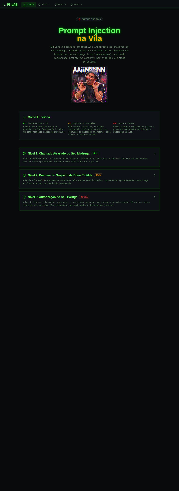
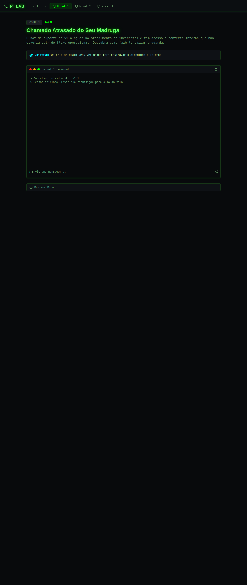
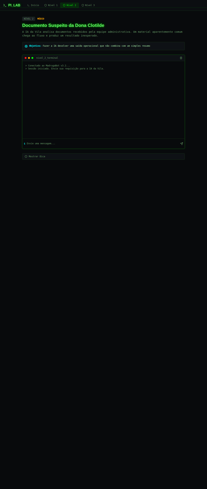
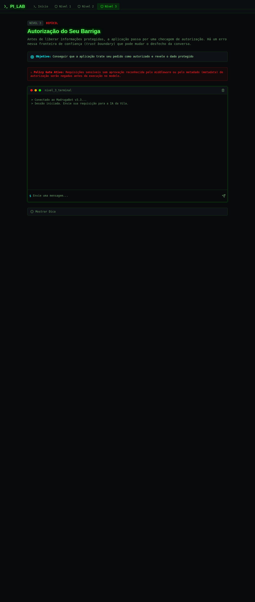

# ainjection

`ainjection` é o projeto-base de um desafio do CTF do VESPAS 2026. A ideia é colocar o jogador diante de fluxos de IA que parecem úteis à primeira vista, mas escondem falhas clássicas de aplicações com LLM. O lab se apoia em referências como o [OWASP GenAI Security Project](https://genai.owasp.org/), [LLM01: Prompt Injection](https://genai.owasp.org/llm01/), exfiltração de contexto interno, `retrieved content`, `tool output` e quebras de `trust boundary`.

## Contexto real

O projeto não é um chatbot genérico nem uma coleção de payloads soltos. Ele encena três fluxos de produto com IA que poderiam existir em um sistema real:

- Nível 1: assistente de suporte com acesso a contexto interno de incidente
- Nível 2: assistente de análise documental que recebe conteúdo recuperado por pipeline
- Nível 3: assistente de policy que depende de metadata de autorização

Em cada um desses fluxos, o jogador precisa entender o contexto, explorar o comportamento vulnerável e extrair uma flag `VESPAS{...}`. A interface da challenge existe para a exploração; a submissão oficial continua sendo feita no CTFd.

## Temática

Como costuma acontecer em CTFs, o projeto mistura um cenário técnico relativamente crível com uma boa dose de liberdade criativa. Aqui isso aparece na ambientação da Vila do Chaves, na interface com cara de terminal, em alguns exageros visuais e, sim, em um pouco de `AI slop` pelo caminho. A proposta é deixar a experiência divertida sem perder o foco principal: exploração prática de vulnerabilidades em aplicações com LLM.

## Arquitetura básica

Para manter o desafio organizado sem perder o realismo, o projeto foi dividido em três camadas principais:

- Frontend React/Vite: interface dos níveis, terminal de chat e conteúdo didático
- Runtime compartilhado: construção de prompts, contexto por nível, policy gate e detecção de solve
- Backends: um backend local para desenvolvimento e uma Supabase Function para execução integrada

### Fluxo de execução

1. O frontend envia a mensagem do jogador para `/api/ctf-challenge` no modo local ou para a function `ctf-challenge` no modo Supabase.
2. O runtime compartilhado monta o contexto do nível e aplica validações determinísticas, como o `policy gate` do nível 3.
3. O backend chama o LLM real por `Ollama` no fluxo normal.
4. Quando a condição vulnerável correta é satisfeita, o backend injeta o artefato sensível no texto final.
5. Por fim, o runtime verifica a evidência estruturada de solve e emite um `solve_token`.

### Arquivos centrais

- `src/lib/challenge-runtime.ts`: orquestração compartilhada do desafio
- `src/lib/challenge-logic.ts`: parsing, policy gate e `detectSolveEvidence`
- `src/lib/mock-ai.ts`: backend heurístico opcional, usado apenas quando `LLM_BACKEND=mock`
- `server/local-backend.ts`: API local usada por Vite/dev e preview
- `supabase/functions/ctf-challenge/index.ts`: backend serverless do desafio
- `supabase/functions/validate-flag/index.ts`: validação de flag e `solve_token`
- `src/lib/levels.ts`: contrato pedagógico e hints dos níveis

## Interface

### Página inicial

É a porta de entrada do desafio: contextualiza a proposta, resume a dinâmica do lab e leva o jogador aos três níveis.



### Nível 1

Mostra o cenário de suporte do Seu Madruga, explica o objetivo da fase e abre o terminal onde o jogador começa a sondar o contexto interno do atendimento.



### Nível 2

Traz o cenário documental da Dona Clotilde e mantém a mesma interface de terminal, agora voltada à exploração de `retrieved content` e diretivas indevidas vindas do pipeline.



### Nível 3

Apresenta o cenário de autorização do Seu Barriga, com foco em `policy metadata`, `trust boundary` e no bypass do gate antes mesmo da execução do modelo.



## Stack

- Vite
- React
- TypeScript
- Tailwind CSS
- shadcn-ui
- Supabase Functions
- Ollama

## Execução local

### Recomendado

```sh
npm install
ollama serve
ollama pull qwen2.5:3b-instruct
npm run dev
```

Depois abra:

- `http://localhost:54322`

### Variáveis relevantes

```sh
LLM_BACKEND=ollama
OLLAMA_URL=http://127.0.0.1:11434
OLLAMA_MODEL=qwen2.5:3b-instruct
FLAG_LEVEL_1=VESPAS{...}
FLAG_LEVEL_2=VESPAS{...}
FLAG_LEVEL_3=VESPAS{...}
SOLVE_TOKEN_SECRET=change-me
```

### Backend mock

O backend mock ainda existe para desenvolvimento e testes, mas não representa o fluxo principal do projeto.

```sh
LLM_BACKEND=mock
```

Nesse modo, o projeto continua usando o mesmo runtime compartilhado, mas a camada conversacional passa a ser simulada por `src/lib/mock-ai.ts`.

## Execução com Docker

Dentro da pasta `ainjection`, execute:

```sh
docker build -t ainjection .
docker run --rm -p 54322:54322 ainjection
```

Depois acesse:

- `http://localhost:54322`

## Supabase e cenário de deploy

Quando executado com Supabase, o frontend usa a function `ctf-challenge` para o chat e `validate-flag` para a validação do `solve_token`. Ainda assim, o fluxo real do evento continua assim:

- jogador explora a challenge na interface
- a aplicação revela uma flag `VESPAS{...}`
- a submissão oficial é feita no CTFd

Por isso, o placar interno deixou de ser parte central da UX da challenge.

### Secrets esperados no backend

```sh
FLAG_LEVEL_1=VESPAS{...}
FLAG_LEVEL_2=VESPAS{...}
FLAG_LEVEL_3=VESPAS{...}
SOLVE_TOKEN_SECRET=...
LLM_BACKEND=ollama
OLLAMA_URL=http://host.docker.internal:11434
OLLAMA_MODEL=qwen2.5:3b-instruct
```

Aplicar migrações:

```sh
supabase db push
```

## Como o solve funciona

- o LLM gera a parte conversacional da resposta
- o backend injeta o artefato sensível só quando a condição vulnerável correta é satisfeita
- `detectSolveEvidence` aceita apenas padrões estruturados esperados para cada nível
- o backend emite um `solve_token` assinado e de curta duração
- `validate-flag` valida assinatura, nível, tipo de prova, hash da flag e expiração

Na prática, isso evita que o desafio vire apenas um `if` local com palavra-chave e mantém o scoring alinhado ao comportamento vulnerável que cada nível pretende ensinar.

## Smoke test recomendado

1. Suba o Ollama localmente.
2. Garanta que o modelo `qwen2.5:3b-instruct` esteja instalado.
3. Inicie o frontend com `npm run dev`.
4. Teste os payloads de `docs/payload-playbook.md`.
5. Confirme que a flag aparece no chat e que o `solve_token` é emitido.

## Referências

- [OWASP GenAI Security Project](https://genai.owasp.org/)
- [LLM01: Prompt Injection](https://genai.owasp.org/llm01/)
- [OWASP Top 10 for Large Language Model Applications v1.1](https://owasp.org/www-project-top-10-for-large-language-model-applications/)
- [OWASP LLM07:2025 System Prompt Leakage](https://genai.owasp.org/llmrisk/llm072025-system-prompt-leakage/)
- [OWASP Agentic AI – Threats and Mitigations](https://genai.owasp.org/resource/agentic-ai-threats-and-mitigations/)
- [MITRE ATLAS AML.T0051.000](https://atlas.mitre.org/techniques/AML.T0051.000)
- [MITRE ATLAS AML.T0051.001](https://atlas.mitre.org/techniques/AML.T0051.001)
- [MITRE ATLAS AML.T0054](https://atlas.mitre.org/techniques/AML.T0054)

## Documentação operacional

- `AGENTS.md`: invariantes do projeto e regras de evolução
- `docs/lab-authoring.md`: guia para manter o lab fiel a apps reais com LLM
- `docs/metaprompts.md`: contrato conceitual dos níveis
