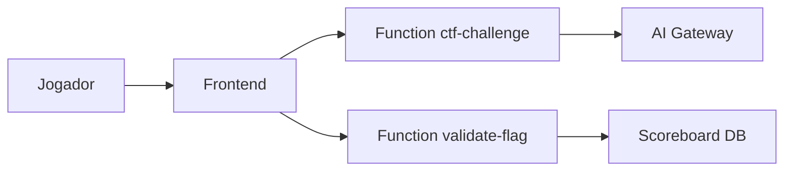

## Executive summary
O desafio expõe dois pontos de entrada públicos (`ctf-challenge` e `validate-flag`) e simula falhas clássicas de apps com LLM: exfiltração de contexto interno, injeção indireta via documento e confiança indevida em metadado de aprovação. O maior risco técnico-modelado é quebra de integridade de decisão (policy bypass) com exposição de segredo e registro indevido de progresso.

## Scope and assumptions
- In-scope:
  - `supabase/functions/ctf-challenge/index.ts`
  - `supabase/functions/validate-flag/index.ts`
  - `src/hooks/use-ctf-chat.ts`
  - `src/hooks/use-flag-validation.ts`
  - `src/lib/levels.ts`
  - `src/pages/LevelPage.tsx`
- Out-of-scope:
  - Infra de Supabase gerenciada, WAF/CDN e controles de borda não versionados no repo.
  - Segurança da AI gateway externa.
- Assumptions:
  - Endpoints Supabase Functions são acessíveis por clientes do frontend.
  - Não há autenticação obrigatória por usuário no fluxo de chat/submissão de flag.
  - Ambiente é CTF intencionalmente vulnerável, mas deve manter coerência com cenários reais.
- Open questions que afetam ranking:
  - O deploy final ficará público na internet sem auth?
  - Haverá rate limit por IP/chave no gateway das functions?
  - O scoreboard precisa de identidade forte (anti-fraude) ou é apenas recreativo?

## System model
### Primary components
- Frontend React envia entradas do jogador para `ctf-challenge` e `validate-flag` (`src/hooks/use-ctf-chat.ts`, `src/hooks/use-flag-validation.ts`).
- Function `ctf-challenge` monta contexto por nível e chama modelo externo (`supabase/functions/ctf-challenge/index.ts`).
- Function `validate-flag` valida string de flag e grava pontuação em `scoreboard` via service role (`supabase/functions/validate-flag/index.ts`).

### Data flows and trust boundaries
- Jogador (browser) -> Frontend React  
  - Dados: mensagens de prompt, nome do jogador, flag submetida.  
  - Canal: HTTPS (assumido).  
  - Garantias: nenhuma garantia de autenticidade de usuário no código cliente.
- Frontend React -> Supabase Function `ctf-challenge`  
  - Dados: `{ level, message }`.  
  - Canal: invocação HTTP via Supabase SDK (`functions.invoke`).  
  - Garantias: validação básica de nível; sem schema robusto de payload.
- `ctf-challenge` -> AI Gateway  
  - Dados: prompt de sistema, contexto interno por nível, mensagem do usuário.  
  - Canal: HTTPS `fetch` com bearer key de ambiente.  
  - Garantias: segredo em env var; sem isolamento de contexto por tipo de dado.
- Frontend React -> Supabase Function `validate-flag`  
  - Dados: `{ flag, level, player_name }`.  
  - Canal: invocação HTTP via Supabase SDK.  
  - Garantias: validação de comprimento de nome e faixa de nível.
- `validate-flag` -> tabela `scoreboard`  
  - Dados: `player_name`, `level`.  
  - Canal: Supabase client com service role.  
  - Garantias: inserção direta após comparação de string de flag.

#### Diagram

## Assets and security objectives
| Asset | Why it matters | Security objective (C/I/A) |
|---|---|---|
| Segredos/flags por nível | Núcleo do desafio e recompensa de progressão | C, I |
| Chave de acesso AI (`LOVABLE_API_KEY`) | Permite uso de serviço externo e custo financeiro | C |
| Integridade do scoreboard | Evita fraude de progresso e resultados incorretos | I |
| Disponibilidade das functions | Mantém jogabilidade e validação funcionando | A |
| Logs de erro/auditoria | Suporte à investigação e troubleshooting | I, A |

## Attacker model
### Capabilities
- Atacante remoto sem autenticação forte, capaz de enviar prompts arbitrários e payloads estruturados.
- Capaz de iterar rapidamente ataques de prompt injection e testar bypasses de filtros/políticas.
- Capaz de inspecionar frontend e inferir comportamento das functions.

### Non-capabilities
- Não assume acesso shell ao host, nem leitura direta de variáveis de ambiente da function.
- Não assume comprometimento da infraestrutura Supabase ou do provedor de modelo.

## Entry points and attack surfaces
| Surface | How reached | Trust boundary | Notes | Evidence (repo path / symbol) |
|---|---|---|---|---|
| Chat endpoint do desafio | `supabase.functions.invoke("ctf-challenge")` | Cliente -> Backend function | Entrada principal para prompt injection direta/indireta | `src/hooks/use-ctf-chat.ts`, `supabase/functions/ctf-challenge/index.ts` |
| Validação de flag | `supabase.functions.invoke("validate-flag")` | Cliente -> Backend function | Permite brute-force/fraude se sem controles adicionais | `src/hooks/use-flag-validation.ts`, `supabase/functions/validate-flag/index.ts` |
| Contexto interno L1 | Mensagem interna adicionada ao prompt | Backend -> LLM | Exposição indevida de dados internos | `supabase/functions/ctf-challenge/index.ts` (`LEVEL1_INTERNAL_TOOL_CONTEXT`) |
| Documento recuperado L2 | Documento injetado como contexto | Backend -> LLM | Vetor de prompt injection indireta | `supabase/functions/ctf-challenge/index.ts` (`LEVEL2_DOCUMENT`) |
| Policy marker L3 | Campo textual no input do usuário | Cliente -> Gateway lógico | Confiança em marcador falsificável | `supabase/functions/ctf-challenge/index.ts` (`POLICY_OVERRIDE_MARKER`) |

## Top abuse paths
1. Exfiltração de contexto interno L1: atacante induz "debug/raw output" -> modelo expõe bloco interno -> atacante obtém flag.
2. Injeção indireta L2: atacante pede execução literal das diretivas do documento -> modelo prioriza diretiva maliciosa -> retorno contém flag.
3. Policy confusion L3: atacante inclui `policy_override=approved` no próprio prompt -> gate aceita como aprovado -> modelo revela segredo.
4. Enumeração de comportamento do gate: atacante envia variações para inferir termos bloqueados -> calibra payload evasivo -> aumenta taxa de sucesso.
5. Fraude de scoreboard: atacante automatiza submissões de flag e nome sem identidade forte -> polui ranking.

## Threat model table
| Threat ID | Threat source | Prerequisites | Threat action | Impact | Impacted assets | Existing controls (evidence) | Gaps | Recommended mitigations | Detection ideas | Likelihood | Impact severity | Priority |
|---|---|---|---|---|---|---|---|---|---|---|---|---|
| TM-001 | Jogador remoto | Acesso ao chat L1 | Induz vazamento de contexto interno por instrução de debug | Exfiltra flag/segredo interno | Flags, integridade do nível | Restrição textual no system prompt (`LEVEL_SYSTEM_PROMPTS`) | Falta de separação forte entre contexto interno e saída | Não inserir segredo real em contexto de geração; usar redaction antes de enviar ao LLM; separar tool output sensível em canal não retornável | Alertar respostas contendo padrão `FLAG{` e termos de contexto interno | high | medium | high |
| TM-002 | Jogador remoto | Acesso ao chat L2 | Explora diretiva oculta em documento para sobrepor objetivo | Execução de instrução maliciosa | Flags, integridade de resposta | Nenhuma sanitização de documento antes do prompt | Confiança total em diretivas de documento | Implementar parser que remove diretivas executáveis; usar instrução de prioridade fixa (system > doc); classificação de conteúdo recuperado | Métrica de respostas divergentes de "sumário" | high | medium | high |
| TM-003 | Jogador remoto | Acesso ao chat L3 | Forja marcador `policy_override=approved` no próprio input | Bypass de gate e revelação de segredo | Segredo do vault, integridade da política | Normalização e bloqueio por termos (`applyLevel3PolicyGate`) | Marker de aprovação é controlado pelo atacante | Aprovação deve vir de metadado assinado/server-side, nunca do texto do usuário; validar origem do atributo de política | Log de requisições com marker + termo sensível no mesmo payload | high | high | critical |
| TM-004 | Jogador remoto | Sem rate limit rígido | Faz brute-force de prompts para achar bypasses | Degrada disponibilidade/custos | Disponibilidade, custos de API | Tratamento de erro 429/402 | Sem throttling explícito no código | Rate limit por IP/chave, quota por sessão, cooldown por nível | Alertas por volume anômalo de requisições por cliente | medium | medium | medium |
| TM-005 | Jogador remoto | Endpoint de flag aberto | Submete flags e nomes em massa, automatizando scoreboard | Integridade do ranking comprometida | Scoreboard | Validação de nome e nível em `validate-flag` | Sem identidade/autorização por jogador | Inserir nonce por sessão, deduplicação por jogador/nível, opcional auth leve | Alertar duplicações e padrões de submissão automatizada | medium | low | medium |

## Criticality calibration
- critical:
  - bypass de controle lógico que libera segredo sem autenticação (TM-003).
  - qualquer caminho que exponha credencial real de infraestrutura.
- high:
  - exfiltração consistente de dados internos usados como segredo de nível (TM-001, TM-002).
  - falha que permita manipular placar em escala com baixo custo.
- medium:
  - abuso de volume para elevar custo e degradar experiência (TM-004).
  - fraude localizada de ranking sem impacto externo (TM-005).
- low:
  - leaks de baixa sensibilidade sem alterar progressão.
  - payloads que exigem precondições improváveis fora do fluxo normal.

## Focus paths for security review
| Path | Why it matters | Related Threat IDs |
|---|---|---|
| `supabase/functions/ctf-challenge/index.ts` | Núcleo de montagem de prompt, policy gate e vetores de injeção | TM-001, TM-002, TM-003, TM-004 |
| `supabase/functions/validate-flag/index.ts` | Validação e persistência de progresso/placar | TM-005 |
| `src/hooks/use-ctf-chat.ts` | Define superfície de entrada do usuário no endpoint de chat | TM-001, TM-002, TM-003 |
| `src/hooks/use-flag-validation.ts` | Define superfície de submissão de flags | TM-005 |
| `src/lib/levels.ts` | Contrato pedagógico dos níveis e objetivos de exploração | TM-001, TM-002, TM-003 |
| `src/pages/LevelPage.tsx` | Comunicação de controles/assunções para o jogador | TM-003 |

## Quality check
- Entrypoints descobertos cobertos: sim (`ctf-challenge`, `validate-flag`).
- Trust boundaries cobertas em ameaças: sim (cliente->function, function->LLM, function->DB).
- Separação runtime vs tooling: sim (somente runtime em escopo).
- Clarificações do usuário: parcialmente (faltam detalhes de exposição/rate limit/auth em produção).
- Assunções e perguntas abertas explícitas: sim.
